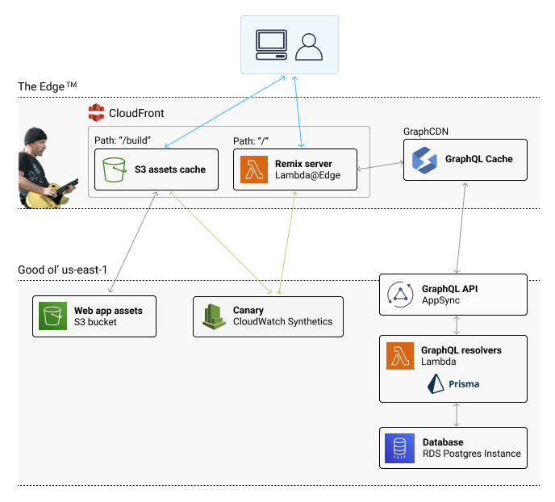

# Remix + GraphQL + Prisma + AWS CDK

This package includes a Remix app, GraphQL API, and AWS infrastructure managed with CDK. TypeScript is used throughout.

You can see it running at https://d1fr84q9611u1h.cloudfront.net/ (unless I take it down to save money).

---

## Stack

### Web app:

- [Remix](https://remix.run/)
- [Tailwind CSS](https://tailwindcss.com/)

### API:

- GraphQL with [Prisma](https://www.prisma.io/) in the resolvers

### AWS Infrastructure:

- Lambda@Edge (runs the Remix server)
- CloudFront + S3 for web assets
- AppSync GraphQL API (with an optional [GraphCDN](https://graphcdn.io/) cache)
- Lambda resolvers for AppSync (uses Prisma for querying the DB)
- RDS PostgresQL instance

I'm not very good at diagrams, but here's my best attempt at laying out the AWS infrastructure, and how the different pieces interact:



---

## Development

This package uses npm workspaces. I've added some root scripts to make interacting with the different packages as easy as possible.

### Deployment

> :warning: **WARNING!!!** This CDK infrastructure does incur charges, and not everything in it is eligible for AWS free tier! I **strongly** recommend setting up an [AWS Budget](https://docs.aws.amazon.com/cost-management/latest/userguide/budgets-managing-costs.html) before proceeding, and destroying the CDK stack if you don't need it when you're done.
>
> I estimate running everything here would come to about $40/month, depending on usage, but I'm not sure. The biggest part of that is the RDS database, which is constantly running on a `t4g.medium` EC2 instance. DynamoDB would probably be better (and much cheaper at small scale) but I'm not using it here because 1) I don't know it well, and 2) I wanted to use Prisma, which doesn't support DynamoDB yet.
>
> Don't forget to run `npm run cdk:destroy` when you're done!

Note: I haven't actually attempted these steps from a fresh clone (I built this package up over time). It's possible things may not work exactly as described. If that's the case, I apologize :(

Before doing anything, you'll need an AWS account that's been bootstrapped for CDK in `us-east-1`. You'll also need the AWS CLI installed and configured to access your account.

To deploy everything to your AWS account:

```sh
npm run deploy
```

This builds everything for production and deploys via CDK.

### Initialize and seed your database

Next, you'll need to use the Prisma CLI to initialize and seed your database.

Edit `packages/api/.env-example` so it uses your actual `DATABASE_URL`. You can find that value with these steps:

1. Go to the AWS Lambda console, then go to your ApiDatasourceLambda function.
2. Click on the "Configuration" tab, and then the "Environment variables" left side nav item.
3. The `DATABASE_URL` will be listed there.

Then, do an initial push to your database:

```sh
npm run api:prisma db push
```

Followed by a command to seed with initial data:

```sh
npm run api:prisma migrate seed
```

If all goes well, your database should now be ready for the Prisma queries defined in the AppSync resolver Lambda function.

At this point, you should be able to view the app at its CloudFront URL. This URL is logged as a CDK output after a successful deployment - it's the one with "CloudFrontDomain" in its name. You can also view all CDK outputs in the AWS CloudFormation console at any time.

### Optional: Set up GraphCDN

I recommend using GraphCDN as a caching layer for your AppSync GraphQL API. It's fantastic. It improves the experience for your users, and should save infrastructure costs as well.

### Run the Remix app locally:

This app uses the AppSync (or GraphCDN) API even in development, so you'll need to have deployed via CDK before starting in dev mode:

```sh
npm run remix:dev
```

This starts your app in development mode (including Tailwind CLI watch mode), rebuilding assets on file changes.
